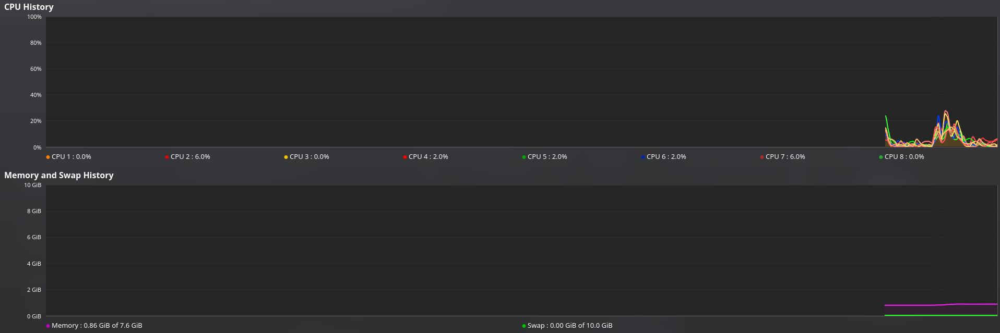
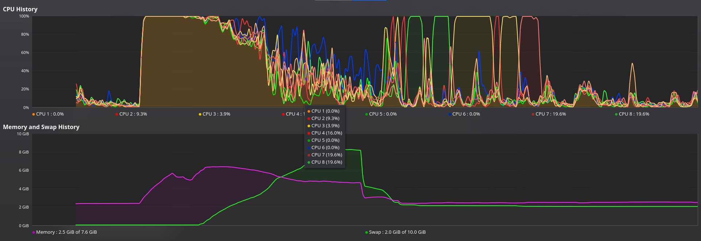

# Shell Script to Overload a Linux System ::

- When you open this bash file, infinite terminals will run, which in turn will freeze your system and make it unresponsive.

- I am working on a way to embed this script inside a pdf or any other file extension. This will help make any system unresponsive.

# Instructions ::

- You can change the terminal emulator name accordingly.

- Some common terminal emulators are ::

  - gnome-terminal
  - xterm
  - guake
  - terminator

- Make sure that you add **&** after the name of the terminal emulator. For instance, if the name of your emulator is **konsole** then replace it with **konsole&**.

# Command to execute the attack ::

```
./infiniteterminal.sh
```

> Please make sure you save any work before executing this command, as your system will become unresponsive and you will have to reboot your system. This in turn will lead to the loss of data. I am not responsible for any loss of data.

# Overload in action ::

### Before running the script ::



### After running the script ::



# Contributing ::

- Please check out the CONTRIBUTING.md guide on how you can actively participate in the development of this side project of mine.
